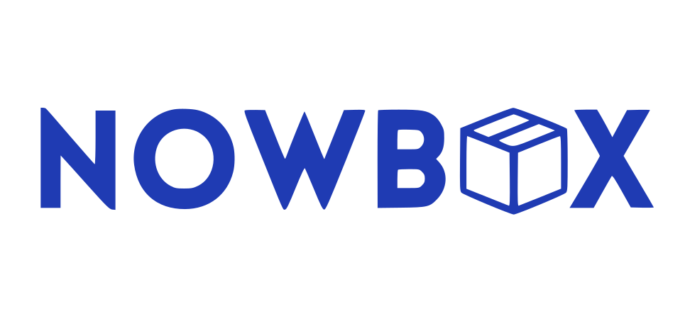

  

  <a href="README.md"><b>Português</b></a> ·
  <a href="README.en.md">English</a>

## Sobre o projeto

O **NowBox** é um sistema completo de gerenciamento para empresas de **self storage** (armazenamento self-service). A plataforma centraliza a operação do negócio, oferecendo:

- **Dashboard administrativo** para acompanhar unidades, clientes e ocupação dos boxes.
- **Sistema de aluguel** de boxes, com agendamento de horários de acesso.
- **Emissão automática de contratos digitais**, eliminando processos manuais de papelada.

O objetivo é simplificar a rotina de empresas do setor, reduzindo trabalho manual e dando visibilidade total da operação em um só lugar.

## Tecnologias

  
  
  
  
  
  
  

